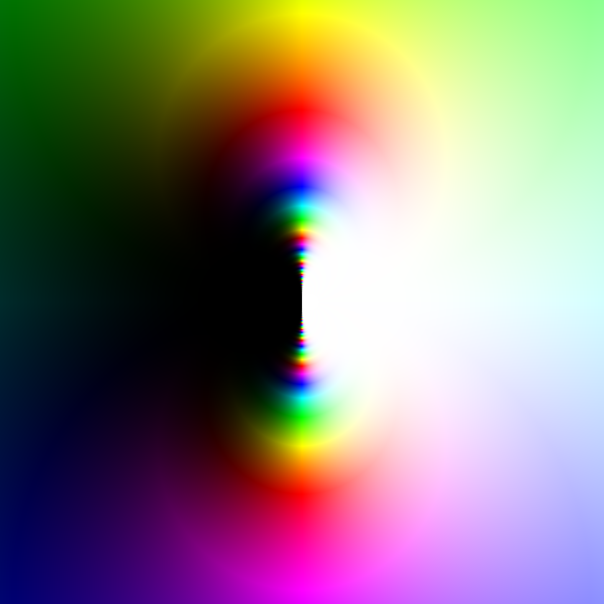

# The intersection of parallel computing and fractals!

This repository contains my implementions of `mandelbrot` and `domain_color` which make use of the [Intel intrinsics](https://www.intel.com/content/www/us/en/docs/intrinsics-guide/index.html) available in C++. Essentially, it enables the element-wise operations on arrays to happen concurrently. This is especially helpful for fractal generation, which involves lots of such operations.

Certain intrinsics used in this repository (the SVML intrinsics) are currently only compatible with the `icc` compiler, which can be installed [here](https://www.intel.com/content/www/us/en/developer/tools/oneapi/dpc-compiler.html).

Currently, the tools support rendering the Mandelbrot set, as well as plotting domain colorings of functions $f: \mathbb{C} \to \mathbb{C}$. A personal favorite of mine is the function $e^{1/z}$, which has an essential singularity at $0$, as shown below.

  

### Future Plans

* Make primitive functions in `simd_domain_color.cpp` return memcopies of their arguments.
* Possibly port everything over to Fortran.
