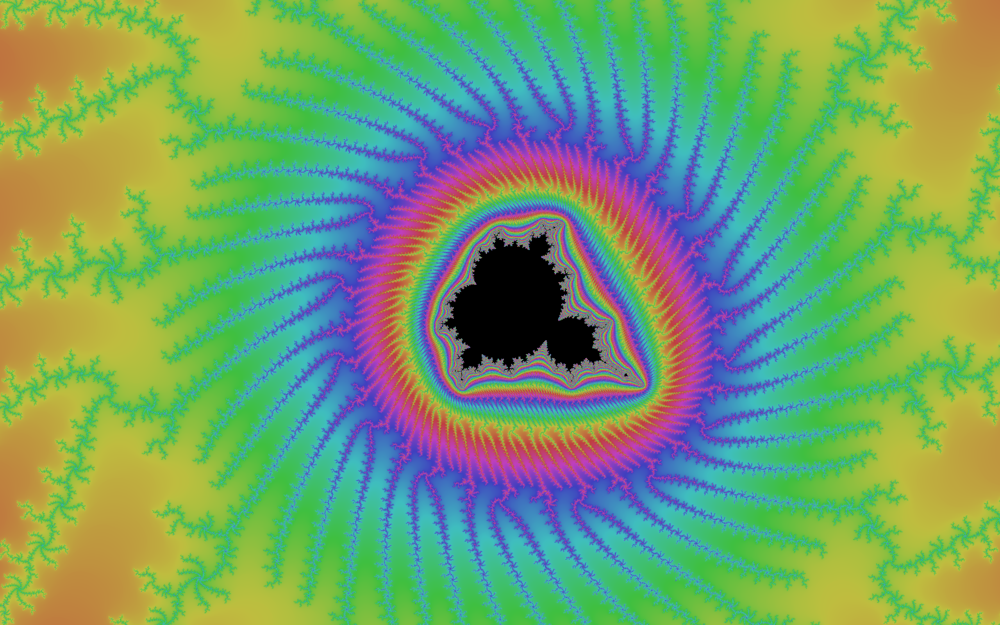

# The intersection of parallel computing and fractals!

This repository contains my implementions of `mandelbrot` and `domain_color` which make use of the [Intel intrinsics](https://www.intel.com/content/www/us/en/docs/intrinsics-guide/index.html) available in C++. Essentially, these enable element-wise operations on arrays to happen concurrently. This is especially helpful for fractal generation, which involves lots of such operations. We get further speed improvements on this front by utilizing multithreading.

With `mandelbrot.cpp`, we can produce renders of the Mandelbrot set, such as the one below.

  

I currently export to `.png` files after doing all the math, however, my end goal is to learn enough OpenGL to make zoomable, pannable fractals.

### What I'm Working On

* Trying to learn [OpenGL](https://learnopengl.com/Getting-started/OpenGL). I would like to render the Mandelbrot set in a window and be able to pan and zoom.
* Adding linear interpolation to `mandelbrot.cc` so the color bands are less visible.
* Bugfixing `domain_color.cpp` which is very much a work in progress. Maybe I should make the primitive functions return memcopies of their arguments?

### References

* Certain intrinsics used in this repository (the SVML intrinsics) are currently only compatible with the `icc` compiler, which can be installed [here](https://www.intel.com/content/www/us/en/developer/tools/oneapi/dpc-compiler.html).
* Installing [OpenGL](https://en.wikibooks.org/wiki/OpenGL_Programming/Installation/Mac) on macOS